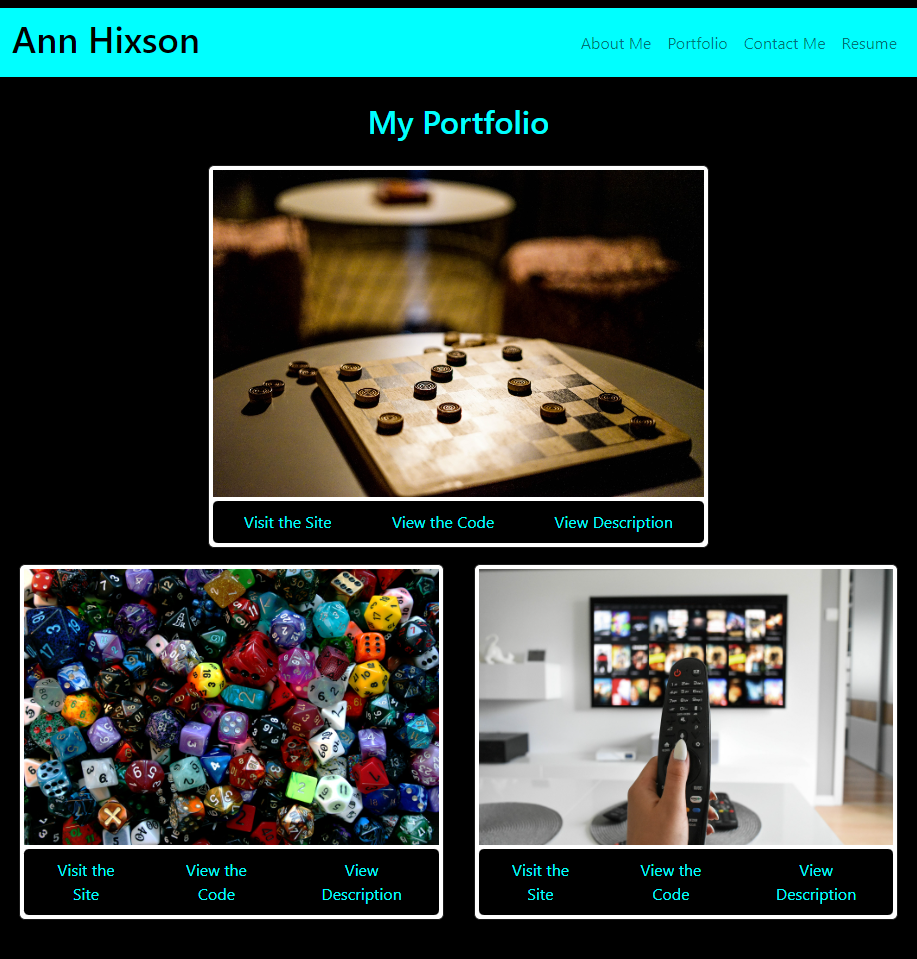

# portfolio

## Description

This is the portfolio of my work as a developer. It features three of the projects I am most proud of so far, as well as an 'About Me' page, my resume, and how to contact me.

## Installation

N/A

## Usage

Clicking on the various tabs at the top will open the different pages. On the 'Portfolio' page, below each project is a link to the deployed site, the GitHub repo, and a description of the project. On the 'Contact Me' page, clicking on the links will open my GitHub profile or LinkedIn. On the 'Resume' page, clicking on the link will open a PDF of my resume.

Here is a screenshot of the application: 

Here is the link to the deployed application: [https://annhixson.github.io/portfolio/](https://annhixson.github.io/portfolio/)

## Credits

Image of checkers is from Tai's Captures via unsplash.
Image of dice is from cocozi via pixabay.
Image of remote and tv is from Mohamed_hassan via pixabay.

## License

None
